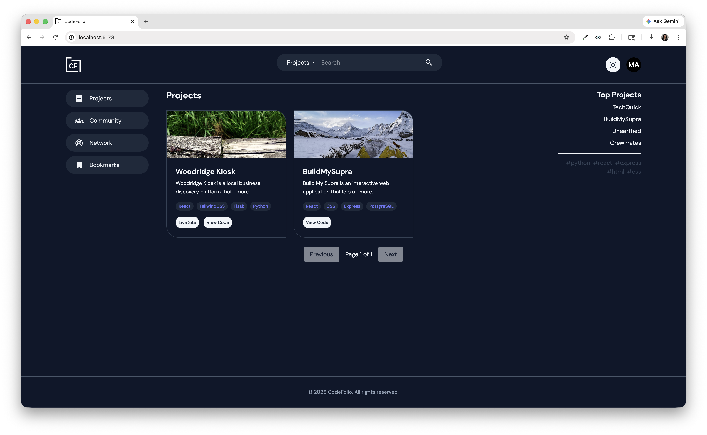

# CODEFOLIO

CodePath WEB103 Final Project

Designed and developed by:
- Mercy Akinyemi
- Dominique Wilson
- Irene Gallini 
- Mycah Accad

🔗 Link to deployed app:

## About

### Description and Purpose

#### Description
CodeFolio is a developer portfolio builder and social platform designed to help users showcase their projects while connecting with other developers. Users can create personalized profiles that highlight their tech stack, bio, location, and social links, along with uploading project details such as images and external links. The application supports CRUD functionality, allowing users to create posts, search for projects, comment on content, manage profiles, and has user authentication. CodeFolio provides an interactive space for developers to collaborate and grow together.

#### Purpose
The purpose of CodeFolio is to create a centralized platform where developers can easily showcase their work and discover others with similar interests. It aims to simplify networking by enabling meaningful connections within the developer community. By offering bite-sized project demos and an intuitive browsing experience, CodeFolio helps users learn from one another, gain inspiration, and open doors to internships, job opportunities, and collaborative projects.

### Inspiration
- As students learning to become developers, we wanted to build a real-world platform that reflects our growth and skills.
- We saw the need for a space where users can easily discover portfolios based on their interests and passions.
- We were inspired by the desire to collaborate with others, showcase our work, and create more opportunities for internships and jobs.

## Tech Stack
- Frontend
    * React JS
    * Vanilla or TailwindCSS
    * HTML

- Backend
    * DB - PostgreSQL
    * Neon
    * Express

## Features

### Required Features (MVP)

### ✅ User Authentication

Users can create an account, log in securely, and access personalized features using OAuth authentication via GitHub

https://github.com/user-attachments/assets/79f95c7d-c524-4910-963e-95bb1bc24e8f

### [User Profile Creation]

Users can create and edit a developer profile that includes their bio, tech stack, location, and social links.

[gif goes here]

### [Create Project]

Users can create and manage projects by adding a title, description, images or GIFs, and external links such GitHub or live demos.

[gif goes here]

### ✅ Project Feed

Users and visitors can browse a feed of uploaded projects to discover work shared by other developers.



### ✅ Project Detail Page

Users can click on a project to view more detailed information, including the project description, walthrough visuals, and related links.


### [Search Functionality]

Users can search for projects by title or keyword to quickly find projefcts related to their interests.

[gif goes here]

### [Like Projects]

Users can like projects to show appreciation and increase engagement on the platform.

[gif goes here]

### Stretch Features (Nice-to-Have)

### [Connection Requests]

Users can send and receive connection requests to build their network and connect with other developers.

[gif goes here]

### [Create on Posts]

Logged-in users can create on posts to ask questions, give feedback, or interact with other creators.

[gif goes here]

### [Commenting on Posts]

Logged-in users can comment on posts to ask questions, give feedback, or interact with other creators.

[gif goes here]

### [Bookmark or Save Projects]

Users can save projects they are interested in so they can revisit them later.

[gif goes here]

### [Notifications]

Users can receive notifications for actions such as new connection requests, accepted requests, or comments on their projects.

[gif goes here]

### [Map-Based Location Display]

Users can display their state or country using a map API to make profiles more interactive and location aware.

[gif goes here]

### [Portfolio Feedback Features]

Users can receive UI/UX or projefct feedback from others to improve the quality of their portfolio and showcased work.

[gif goes here]

## Installation Instructions

1. **Clone the repository**
   ```bash
   git clone https://github.com/DevDominique/codefolio.git
   cd CODEFOLIO
   ```

2. **Install dependencies**
   ```bash
   cd client
   npm install
   ```
     ```bash
   cd server
   npm install
   ```

3. **Set up environment variables**
- Server Directory
   ```bash
   touch .env
   ```
   
   Add your keys for server dir:
   ```env
   DATABASE_URL=your_neon_url
   CLIENT_URL=your_deployed_website_url
   GITHUB_CLIENT_ID=your_github_client_id
   GITHUB_CLIENT_SECRET=github_client_secret
   ```

4. **Run development server**
   ```bash
   npm run dev
   ```

## Database Migrations

Use migrations for schema updates so existing data is preserved.

From the `server` directory:

1. Check migration status
   ```bash
   npm run migrate:status
   ```

2. Run pending migrations
   ```bash
   npm run migrate
   ```

3. Use reset only when you want to drop and recreate all tables
   ```bash
   npm run reset
   ```

Notes:
- `npm run migrate` applies each migration file once and records it in `schema_migrations`.
- `npm run reset` is destructive and should only be used for local clean rebuilds.
