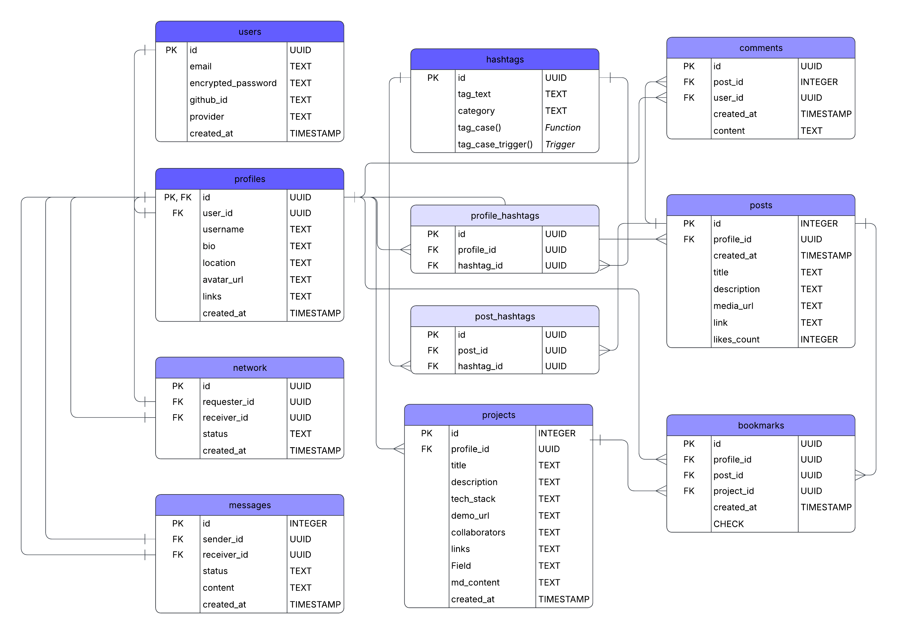

# Codefolio Entity Relationship Diagram (ERD)

This ERD outlines the core structure of Codefolio’s backend, including user accounts, profiles, content, relationships, and tagging. It is organized into three sections: Entity Tables, Join Tables, and Utility Tables.

## List of Tables

🧱 **Entity Tables** - *Core Resources*
These tables represent the primary data models for users, content, and interactions across the platform.

- **Users** - Handles authentication via GitHub OAuth and stores core account credentials and metadata.
- **Hashtags** - Stores reusable tags for skills, technologies, and post topics.
- **Profiles** - Public-facing profile information linked to each authenticated user.
- **Posts** - User-generated posts in the social feed, including media, descriptions, and links.
- **Projects** - Markdown-based showcases of a user’s projects, tech stack, and demos.
- **Network** - Tracks relationship requests between users (e.g., follow, connect).
- **Messages** - Records private messages exchanged between profiles, including sender, receiver, content, and read status.
- **Comments** - Stores comments made by users on posts.

🔗 **Join Tables** - *Many-to-Many Relationships*
These tables manage relational mappings between core entities, enabling flexible tagging and discovery features.

- **profile_hashtags** - Connects profiles to hashtags to display skills and tech stack.
- **post_hashtags** - Connects posts to hashtags for topical discovery in the feed.

🛠️ **Utility Table** - *Supporting Feature*
This table supports additional platform functionality that enhances user experience.

- **Bookmarks** - Stores a user’s saved posts or portfolio items. Includes constraints ensuring each bookmark references exactly one item and prevents duplicates.

## Entity Relationship Diagram

